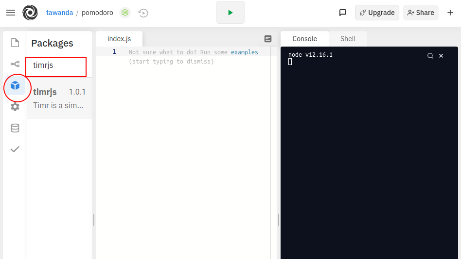
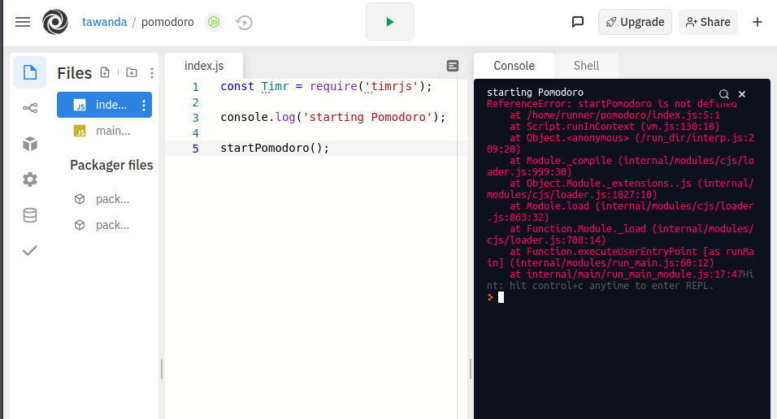
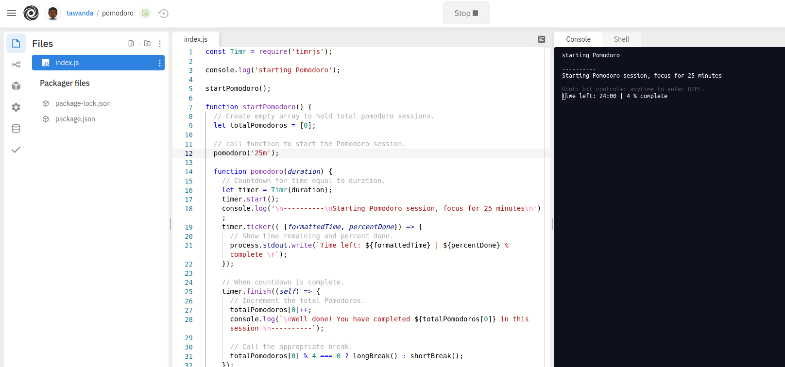

# Building a Pomodoro Timer with NodeJs and Repl.it

In this tutorial we'll use NodeJS on Repl.it to build a Pomodoro timer. The [Pomodoro Technique](www.francescocirillo.com)  is a  time management method developed by Francesco Cirillo in the 80s. The technique uses a timer to break down work into intervals called Pomodoros, typically of 25 minutes, separated by short breaks of 5 minutes. After four Pomodoros you take  a longer break, typically 15 minutes.

Our timer will show a countdown timer for both the Pomodoros and the breaks, as well as the total number of completed Pomodoros.

This tutorial assumes knowledge of basic JavaScript concepts such as functions and objects. However the code is explained so that even a beginner may follow along.


## Creating a Repl and adding dependencies

First, we need to create a new Node.js Repl for our code. Navigate to repl.it and create a new Repl, selecting "Node.js" as the language. You may name the Repl however you wish.

We then want to add our only dependency, Timrjs. TimrJS is a library for creating timers in JavaScript. It saves us from implementing our own timer and comes with some cool features that we can use.

In the default `index.js` file that is included in the new Repl, add the following code:

`const Timr = require('timrjs')`

Press the "Run" button and you should see Repl.it install the Timr library and adding it to the dependencies in the `package.json` file. If this does not work click the cube icon on the left panel- it allows you to search for packages by name - and search for "timrjs". 




## Our Program


### Structure

Our program will be made up of a few separate functions. When it starts we have  a function called `startPomodoro`, which when called starts a countdown of 25 minutes. 

When the countdown ends the program either calls a short break or a long one, and when the break is over,  another Pomodoro begins.

```
startPomodoro () {
    pomodoro() {
        break() {
            pomodoro()
        }
    }
}

```


### Code

When we press run we want to output a message to show that the program is running. So in the index.js file, below our require statement, we place a `console.log` statement:

``` 
console.log('starting Pomodoro');
```

Immediately below, we call the function that starts the Pomodoro:

```
startPomodoro();
```

If we run the program at this point, we get an error `ReferenceError: startPomodoro is not defined....` because the function  `startPomodoro` does not exist.



So we need to create our function. We can do this using the function declaration method. Declaring functions this way means that they are added to the top of the program. It therefore does not matter if the function is defined *after* it is called, because all function declarations are moved to the top of their scope before the code is executed. This is called [*hoisting*](https://www.w3schools.com/js/js_hoisting.asp).

```
function startPomodoro() {
    
    // Create empty array to hold total pomodoro sessions
    let totalPomodoros = [0];
    
    // Call function to start  the Pomodoro session.
    pomodoro();

```

Let's break this down.

In our `startPomodoro` function we start by creating an empty array called `totalPomodoros`. This array will hold the total number of completed pomodoro sessions.

We then call the function  `pomodoro` to start a Pomodoro session.

However, as before, the `pomodoro ` function is not defined, so we have to define it. This is one of the reasons why hoisting is useful, it allows us to use functions before they are declared, making our code more readable.


### Pomodoro Session Function

We now define the function for our pomodoros. We've named it `pomodoro` and have comments as placeholders for what we want it to do:

```
function pomodoro(duration) {
    // Countdown for time equal to duration.
    // Show time remaining and percent done.
    // When countdown is complete, increment the total Pomodoros and
    // Call the appropriate break.
}

```
The comments act as guides of what we want our function to do. First it should count down for the length of our Pomodoro. It should also show on the console the time remaining and the percentage done.

When the countdown reaches zero the function must record a succcessful Pomodoro to the `totalPomodoros` array we have already created.

Then it should decide whether to call a short break or a long one.

Let us code these steps in turn.

To perform the counting, we turn to the library we imported at the top of the file TimrJS.


### TimrJs

TimrJS is a library for creating timers in JavaScript. It saves us from implementing our own timer.

Timr returns an object which has several properties including `events`, `timer`, `running` and `options`, which is itself an object.

There are two key events in Timr, `ticker` and `finish`. Ticker is called every second, and emits an object that contains several properties. We are interested in:
- `formattedTime` and
- `percentDone`

`finish` is called once, when the countdown reaches zero and takes in a callback that is called when the timer is finished. 

TimrJs also has more customization options which you can check out on the library's documentation on npm. We will use it twice, in the `pomodoro` function and in counting down the break sessions.

So we add the following code to our `pomodoro` function:

```
// Countdown for time equal to duration.
    let timer = Timr(duration);
    timer.start();
    console.log('\n----------\nStarting Pomodoro session, focus for 25 minutes\n');
    timer.ticker(( {formattedTime, percentDone}) => {
      // Show time remaining and percent done.
      process.stdout.write(`Time left: ${formattedTime} 
       ${percentDone} % complete \r`);
    });

    // When countdown is complete.
    timer.finish((self) => {
      // Increment the total Pomodoros.
      totalPomodoros[0]++;
      console.log(`\nWell done! You have completed ${totalPomodoros[0]} in this session \n----------`);

      // Call the appropriate break.
      totalPomodoros[0] % 4 === 0 ? longBreak() : shortBreak();
    });

```
The code above does several things. First we assign the variable   `timer ` to the Timr object and give it a parameter *duration*.

Then we start the timer using the method `timer.start()`. We then use `timer.ticker()` to select  and show the properties we want, namely the time left and the percent done. We write this out to console using the inbuilt node module `process.stout.write()`. Using the `\r` special character clears the line every time the callback executes. 

The `timer.finish()` method runs when the timer reaches zero, and accepts a callback function. When a pomodoro ends, we want to increment the total number of pomodoros in the   `totalPomodoros` array. 

We then use the ternary operator to figure out if we should call a long break or a short one. In the Pomodoro Technique, a long break is called after 4 Pomodoro sessions. The ternary operator behaves like an if else statement: if the expression on the left side of the question mark resolves to true, execute the statement in the middle, otherwise execute the one on the right. So if the total number of Pomodoros, stored in the totalPomodoros array, is divisible by 4 then call long break, otherwise call a short break. The same code could be done using an if/ else statement:

```
     if ( totalPomodoros[0] % 4 === 0 ) {
         longBreak();
     }
     else {
        shortBreak();
     }

```

### Breaks

We now want to define our two break functions, `shortBreak` and `longBreak`. Both of them simply call another function called `countdownBreak` which takes in the duration of our break, ie 5 or 15 minutes respectively. We declare them below the pomodoro function:

```
function shortBreak() {
    console.log(''Short break, relax for 5 minutes');
    countdownBreak('5m');
 }

 function longBreak() {
    console.log(''Short break, relax for 5 minutes');
    countdownBreak('15m');
 }

```
Lastly we define the `countdownBreak` function which is used by both the shortBreak and longBreak functions. It will take in the length of  a break session, and when the break is done, will call the pomodoro function to start a new work session.

```
function countdownBreak(duration) {
    let timer = Timr(duration);
    timer.start();
    timer.ticker(({formattedTime, percentDone}) => {
    process.stdout.write(`\tRest for: ${formattedTime}\r`);
    })
    
    timer.finish(() => {
      console.log(`now that you are fresh, let's work!`)
      countdownPomodoro('25m');
    });
  }
  
```


## Putting it all together

Our Code now looks like this:

```
const Timr = require('timrjs');

console.log('starting Pomodoro');

startPomodoro();

function startPomodoro() {
    // Create empty array to hold total pomodoro sessions.
    let totalPomodoros = [0];

    // call function to start the Pomodoro session.
    pomodoro('25m');

    function pomodoro(duration) {
        // Countdown for time equal to duration.
        let timer = Timr(duration);
        timer.start();
        console.log('\n----------\nStarting Pomodoro session, focus for 25 minutes\n');
        timer.ticker(( {formattedTime, percentDone}) => {
        // Show time remaining and percent done.
        process.stdout.write(`Time left: ${formattedTime} | ${percentDone} % complete \r`);
        });

        // When countdown is complete.
        timer.finish((self) => {
        // Increment the total Pomodoros.
        totalPomodoros[0]++;
        console.log(`\nWell done! You have completed ${totalPomodoros[0]} in this session \n----------`);

        // Call the appropriate break.
        totalPomodoros[0] % 4 === 0 ? longBreak() : shortBreak();
        });
    };

    function shortBreak() {
        console.log('Short break,relax for 5 minutes');
        countdownBreak('5');
    };

    function longBreak() {
        console.log('Long break,relax for 15 minutes');
        countdownBreak('15');
    };

    function countdownBreak(duration) {
        let timer = Timr(duration);
        timer.start();
        timer.ticker(({formattedTime, percentDone}) => {
        process.stdout.write(`\Rest for: ${formattedTime}\r`);
        })
    
        timer.finish(() => {
            console.log(`now that you are fresh, let's work!`);
        pomodoro('25m');
        });
    } 
}

```

If you run it you should see something like this on the console:




## Extending our Pomodoro Timer

There are many ways we can extend our Pomodoro timer to make it more useful. Some ideas include:
- Allowing users to decide how long their Pomodoros and breaks should be
- Turn it into a globally accessible command line interface (CLI) tool with commands and options for extra functionality
- Adding more control, for pausing, reseting etc
- Add sound notifications when a timer runs out
- Add functionality to take notes at the end of each pomodoro, like git commit messages. You could, for example, create each pomodoro as an object and give it properties such as message, duration, start time etc
- Write out Pomodoros to a file that you can then review at the end of the day or week.


As you can see there are many ways of improving our timer to make it more useful. Happy hacking! 